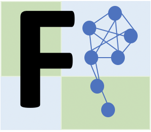

 

# FunPart

 

#### FunPart: Deciphering and characterizing functional heterogeneity in single cell data

FunPart is a computational tool that partitions heterogeneous cell populations into functionally distinct subpopulations and simultaneously identifies modules of functionally relevant set of genes for each of them.

## How to install it

#### Installation of FunPart using Devtools

```R
install.packages("devtools")
library("devtools")
install_github("BarlierC/FunPart")
```

## How to use it

#### Load all the necessary packages and prepare the parallel environment
```R
# Load packages and dependencies
library(pheatmap)
require(data.tree)
require("plyr")
require("igraph")
require("EnvStats")
require("data.table")
library(stringr)
library(clusterProfiler)
library(Matrix)
library(doParallel)
library(foreach)
require(Seurat)
library(WGCNA)
require(funpart)

#Parallel background, using 4 cores
clustnum <- parallel::makeCluster(4)
doParallel::registerDoParallel(clustnum)

options(stringsAsFactors = FALSE)
```

#### Load necessary data to run FunPart
```R
# 1) The annotation file: annotated immune modules by Singhania et al. (https://doi.org/10.1038/s41467-019-10601-6) 
data(gda)

# 2) Mouse Transcription factors 
data(mouse_tfs)

# 3) Your data (matrix or dataframe with cells in columns and genes in rows)
#data_exp
```

#### Run FunPart
```R
#Run FunPart with default parameters
res <- run_functional_splitting(data_exp,mouse_tfs$Symbol,gda)
```

## FunPart parameters
1. **scm** - single cell RNA-seq expression matrix (*cells in columns, genes in rows)
2. **tfs** - vector of TFs names or ID (*it needs to match with the type of genes you have in your matrix*)
3. **gda** - file used to perform the functional enrichment
4. **norm** - perform normalization (*using Seurat, default is TRUE*)
5. **qtarget** - quantile to select the strongest target genes for each identified cliques (*default to 0.90*)
6. **adjMethod** - method used in the enrichment part to perform the p-value adjustement (*for possible values, see enricher package, default = "bonferroni"*)
7. **cutoff** - p-adjusted value cutoff for the functional enrichment (*default=0.05*)
8. **percExp** - percentage of cells a gene needs to be expressed in to be considered (*default=10%)
9. **qExp** - quantile for which the gene expression not be used as considered too low (*default=0.05*)


## FunPart object
The output is an **object of class 'functionalSplitting'** composed of **6 slots**:
1. **data** - *contains the filtered and normalized matrix used to perform the analysis*
2. **clust** - *contains the functional cell states identified*
3. **genesets** - *list containing all the genes used to split each level*
4. **cliques** - *list of TFs cliques and genes identified for each branch C1 or C2 and each level*
5. **functionalenrich** - *list of all the significant functional enrichment found for each genes modules*
6. **modules** - *list of all the genes modules identified*


## Get Summary Table of FunPart object
The function 'getModuleFunctionalState()' will summarize FunPart results into a summary table with 6 columns:
1. **Module**: M1 or M2 (*correspond to cliques slot C1 or C2 of functionalSplitting object respectively*)
2. **Branch**: level and branch (*e.g., 0_0_1 is third level branch 1, 0_1 is second level branch 1 and 0 is first level branch 0*)
3. **Type**: intermediate or direct genes modules. An intermediate genes modules characterize a group of functional states whereas a direct modules genes characterize the specific functional state.
4. **TFs**: transcription factors of the clique (of the genes modules)
5. **Genes**: genes having a direct interaction with TFs of the clique. TFs of the clique + genes having a direct interaction = genes module
6. **Enrichment**: immune processes enriched for the specific module

```R
summary_table <- getModuleFunctionalState(res)
```


